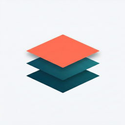

  

<h1 align="center">Ashlr AI</h1>

  <b>AI-native developer tools and vertical AI products.</b> 
  <i>Digital Masonry — built brick by brick, for professionals who want dramatic leverage.</i>

  
  
  

---

<h2 align="center">🛠️ Dev Tools</h2>

Open-source primitives that compress AI-coding workflows.

<table>
  <tr>
    <td width="33%" valign="top" align="left">
      

        
        <b><a href="https://github.com/ashlrai/ashlrcode">ashlrcode</a></b> 
        Multi-provider AI coding agent for the terminal.
      

      <pre><code>bun install -g ashlrcode</code></pre>
    </td>
    <td width="33%" valign="top" align="left">
      

        
        <b><a href="https://github.com/ashlrai/ashlr-plugin">ashlr-plugin</a></b> 
        Cut Claude Code token usage by 57% on real codebases.
      

      <pre><code>curl -fsSL plugin.ashlr.ai/install.sh | bash</code></pre>
    </td>
    <td width="33%" valign="top" align="left">
      

        
        <b><a href="https://github.com/ashlrai/phantom-secrets">phantom-secrets</a></b> 
        Stop AI agents from leaking API keys. Local proxy + MCP.
      

      <pre><code>npx phantom-secrets init</code></pre>
    </td>
  </tr>
  <tr>
    <td width="33%" valign="top" align="left">
      

        
        <b><a href="https://github.com/ashlrai/ashlr-stack">ashlr-stack</a></b> 
        Provision, wire &amp; operate your entire dev stack with one command.
      

      <pre><code>brew install ashlrai/ashlr/stack</code></pre>
    </td>
    <td width="33%" valign="top" align="left">
      

        
        <b><a href="https://github.com/ashlrai/webfetch">webfetch</a></b> 
        License-first image search across 24 providers, MCP-native.
      

      <pre><code>npm i -g getwebfetch</code></pre>
    </td>
    <td width="33%" valign="top" align="left">
      

        
        <b><a href="https://github.com/ashlrai/ashlr-pulse">ashlr-pulse</a></b> 
        Mission control for agentic-engineering teams.
      

      <pre><code>curl -fsSL pulse.ashlr.ai/install.sh | sh</code></pre>
    </td>
  </tr>
  <tr>
    <td width="33%" valign="top" align="left">
      

        
        <b><a href="https://github.com/ashlrai/morphkit">morphkit</a></b> 
        React/TS web app → production SwiftUI iOS in seconds.
      

      <pre><code>npx morphkit-cli plan ./app</code></pre>
    </td>
    <td width="33%" valign="top" align="left">
      

        
        <b><a href="https://github.com/ashlrai/idle">idle</a></b> 
        DePIN orchestrator menu-bar app for macOS passive earnings.
      

      <pre><code>brew install --cask ashlrai/idle/idle</code></pre>
    </td>
    <td width="33%" valign="top" align="left">
      

        
        <b><a href="https://github.com/ashlrai/binshield">binshield</a></b> 
        Snyk for binaries — Ghidra + AI + YARA for npm supply-chain risk.
      

      <pre><code>pnpm add -D binshield</code></pre>
    </td>
  </tr>
  <tr>
    <td width="33%" valign="top" align="left">
      

        
        <b><a href="https://github.com/ashlrai/ashlr-workbench">ashlr-workbench</a></b> 
        Local agent workbench — OpenHands + Goose + Aider + ashlrcode.
      

    </td>
    <td width="33%" valign="top" align="left">
      

        
        <b><a href="https://github.com/ashlrai/ashlr-core-efficiency">core-efficiency</a></b> 
        Token-efficiency primitives that power <code>ashlr-plugin</code>.
      

      <pre><code>npm i @ashlr/core-efficiency</code></pre>
    </td>
    <td width="33%" valign="top" align="center">
       
      <a href="https://github.com/orgs/ashlrai/repositories">
        <b>browse all repos →</b> 
        30+ projects in the org
      </a>
    </td>
  </tr>
</table>

---

<h2 align="center">🧠 Vertical AI Products</h2>

Deep-on-workflow AI software for specific professions.

<table>
  <tr>
    <td width="33%" valign="top" align="left">
      

        
        <b><a href="https://measurably.dev">measurably.dev</a></b> 
        Strava for AI usage — track &amp; improve your AI effectiveness.
      

    </td>
    <td width="33%" valign="top" align="left">
      

        
        <b><a href="https://bi.ashlr.ai">bi.ashlr.ai</a></b> 
        Ashlr BI — smarter business decisions, less chaos.
      

    </td>
    <td width="33%" valign="top" align="left">
      

        
        <b><a href="https://trytriage.ai">trytriage.ai</a></b> 
        AI email copilot for insurance agencies. Inbox, sorted.
      

    </td>
  </tr>
  <tr>
    <td width="33%" valign="top" align="left">
      

        
        <b><a href="https://trykoala.ai">trykoala.ai</a></b> 
        Agentic personal finance — your money, understood.
      

    </td>
    <td width="33%" valign="top" align="left">
      

        
        <b><a href="https://tryprobe.io">tryprobe.io</a></b> 
        Probe AI — deep research platform for high-stakes decisions.
      

    </td>
    <td width="33%" valign="top" align="center">
       
      <a href="https://ashlr.ai">
        <b>see them all →</b>
      </a>
    </td>
  </tr>
</table>

---

<h2 align="center">📚 AI Encyclopedias</h2>

Definitive, AI-augmented reference sites built on our <a href="https://github.com/ashlrai/artist-encyclopedia-factory">factory framework</a>.

<table>
  <tr>
    <td width="25%" align="center" valign="top">
      <a href="https://yeuniverse.com"><h3>🎤 Yeuniverse</h3></a>
      Kanye, every era. 
      <code>yeuniverse.com</code>
    </td>
    <td width="25%" align="center" valign="top">
      <a href="https://swiftiepedia.com"><h3>✨ Swiftiepedia</h3></a>
      Every Taylor Swift easter egg. 
      <code>swiftiepedia.com</code>
    </td>
    <td width="25%" align="center" valign="top">
      <a href="https://dontoliverse.com"><h3>🌵 Dontoliverse</h3></a>
      Every album &amp; collaborator. 
      <code>dontoliverse.com</code>
    </td>
    <td width="25%" align="center" valign="top">
      <a href="https://elon.ashlr.ai"><h3>🚀 Elon-verse</h3></a>
      Every company &amp; tweet. 
      <code>elon.ashlr.ai</code>
    </td>
  </tr>
</table>

---

<h2 align="center">👥 Behind Ashlr</h2>

  Founded January 2026. Headquartered in Virginia, USA.  
  Built by <a href="https://github.com/masonwyatt23"><b>Mason Wyatt</b></a> (CEO) and a small, focused team.

  Most repos ship a one-line install. Open any repo and look for the install command at the top of its README.

---

  ©&nbsp;2026 AshlrAI, Inc. · Delaware C-Corp · <a href="https://ashlr.ai">ashlr.ai</a>

