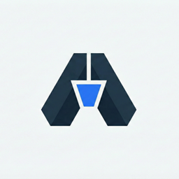
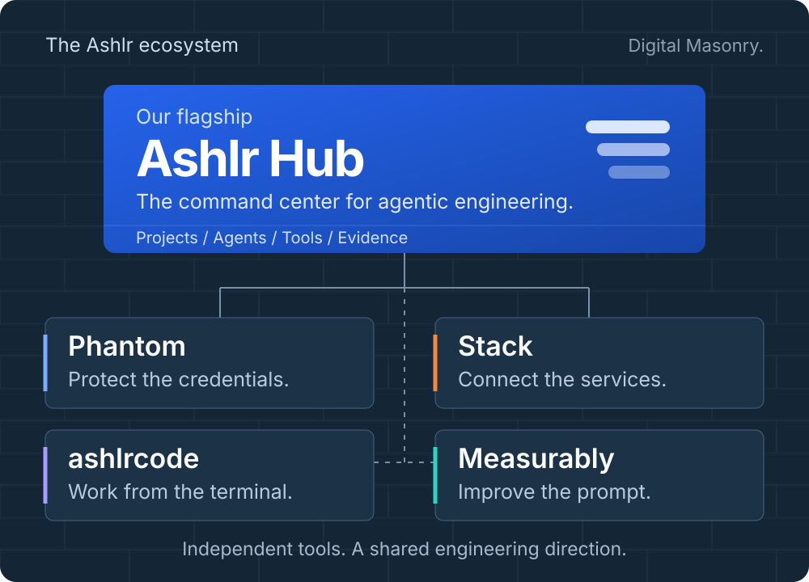

  

<h1 align="center">Engineering beyond the prompt.</h1>

  <b>We’re building the tools around the agent.</b> 
  The workspace. The credentials. The infrastructure. The feedback loop.

  <a href="https://github.com/ashlrai/ashlr-hub"><b>Start with Ashlr Hub</b></a> &nbsp; / &nbsp;
  <a href="https://ashlr.ai">Meet Ashlr.AI</a> &nbsp; / &nbsp;
  <a href="https://ashlr.ai/contact">Build with us</a>

  

## Ashlr Hub is where we’re going.

**Our flagship: a local command center for agentic engineering.** Bring projects, coding agents, MCP tools, and experiment evidence into one workflow. Hub is the front door to the Ashlr ecosystem—and the local kernel behind our Ashlr Universe work.

The ambition is simple: give an engineering system an objective, let it explore competing approaches, evaluate what it produces, and learn from the results. We’re building toward that through local tools, inspectable evidence, and deliberate human control.

- **A place to operate.** A CLI and dashboard for projects, agent workflows, and tools.
- **A place to experiment.** Universe source tooling for generating, evaluating, and retaining competing code variants.
- **A place to connect.** Independently useful projects, brought into a shared engineering workflow.

**[Explore Hub](https://github.com/ashlrai/ashlr-hub)** · [Quickstart](https://github.com/ashlrai/ashlr-hub/blob/master/docs/QUICKSTART.md) · [Universe architecture](https://github.com/ashlrai/ashlr-hub/blob/master/docs/ASHLR-UNIVERSE.md) · [Roadmap and north star](https://github.com/ashlrai/ashlr-hub/blob/master/docs/NORTH-STAR.md)

Hub’s guides distinguish released capabilities, source experiments, and the larger roadmap. The ecosystem map describes our direction; it does not imply every integration is already available.

---

## Phantom. Give agents access. Keep your keys.

  

Our most-starred public project tackles a fundamental problem: agents need to use services, but real credentials shouldn’t have to live in their context. Phantom combines scoped placeholders, a local proxy, and MCP tools to handle supported API work while keeping real credentials out of agent context.

  

**[Explore Phantom](https://phm.dev)** · [Source](https://github.com/ashlrai/phantom-secrets) · [Documentation](https://github.com/ashlrai/phantom-secrets/blob/main/docs/README.md)

## More of the system, one useful tool at a time.

<table>
<tr>
<td width="50%" valign="top">
<h3><a href="https://github.com/ashlrai/ashlr-stack">Ashlr Stack</a></h3>

<b>Bring your infrastructure into the conversation.</b>

Provision services, connect project configuration, and work with your development stack through a CLI and MCP tools. Phantom handles credentials.

<a href="https://stack.ashlr.ai">Explore Stack</a> · <a href="https://github.com/ashlrai/ashlr-stack">Source &amp; setup</a>

</td>
<td width="50%" valign="top">
<h3><a href="https://measurably.dev">Measurably</a></h3>

<b>See what your prompt is missing.</b>

Local prompt scoring and coaching across six dimensions. Understand the structure of your request, improve it, and take a clearer brief to your AI.

<a href="https://measurably.dev">Try the web coach</a>

</td>
</tr>
<tr>
<td width="50%" valign="top">
<h3><a href="https://github.com/ashlrai/ashlrcode">ashlrcode</a></h3>

<b>Your terminal. Your models. Your workflow.</b>

A multi-provider coding agent with MCP tools, persistent sessions, project memory, and parallel agents. An execution tool you can inspect and extend.

<a href="https://github.com/ashlrai/ashlrcode">Explore the agent</a>

</td>
<td width="50%" valign="top">
<h3><a href="https://github.com/ashlrai/ashlr-plugin">Ashlr Plugin</a></h3>

<b>Make every context window work harder.</b>

Token-efficient tools for Claude Code workflows, backed by reusable reading, searching, editing, and context-management primitives.

<a href="https://github.com/ashlrai/ashlr-plugin">Explore the plugin</a> · <a href="https://github.com/ashlrai/ashlr-core-efficiency">Core library</a>

</td>
</tr>
</table>

There’s more in the workshop: [WebFetch](https://github.com/ashlrai/webfetch) for image discovery with licensing information, [Morphkit](https://github.com/ashlrai/morphkit) for exploring native SwiftUI from web applications, and [BinShield](https://github.com/ashlrai/binshield) for binary supply-chain analysis.

**[Explore our public repositories](https://github.com/orgs/ashlrai/repositories?type=public)**

## Digital Masonry, in the real world.

We build these tools because we build software for people. Ashlr works with enterprises, funded startups, and government contractors on custom applications, systems integration, and practical AI implementation. Product work and client work inform each other.

Our product portfolio also includes [Ashlr BI](https://ashlrbi.com), [Koala Finance](https://trykoala.ai), [Triage](https://trytriage.ai), and [Probe](https://tryprobe.io). [Explore the portfolio](https://ashlr.ai/products) or [see selected client work](https://ashlr.ai/work).

**Build with the founders.** Mason Wyatt, Mason Scofield, and Evan Deloria lead AshlrAI, Inc., a **Virginia C corporation**. Have a hard engineering problem, an integration idea, or a contribution in mind? We’d like to hear it.

**[Talk to us](https://ashlr.ai/contact)** · [support@ashlr.ai](mailto:support@ashlr.ai) · [Meet the team](https://ashlr.ai/about)

© 2026 AshlrAI, Inc. · Virginia, USA · Digital Masonry.

