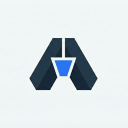

  

<h1 align="center">Ashlr.AI</h1>

  <b>Forward-deployed software and AI engineering.</b> 
  We embed with enterprise, government-contractor, and funded product teams to connect critical
  systems, automate the work between them, and ship production software the organization can
  operate and own.

  <a href="https://ashlr.ai">ashlr.ai</a> &nbsp;/&nbsp;
  <a href="https://ashlr.ai/work">Selected work</a> &nbsp;/&nbsp;
  <a href="https://ashlr.ai/developer-tools">Developer tools</a> &nbsp;/&nbsp;
  <a href="https://ashlr.ai/contact">Build with us</a>

  
  
  

---

The repositories here are the tools we build for ourselves, released as open source (MIT unless
noted) because the same problems show up in every engagement. Product work and client work inform each other: the tools
sharpen the systems we deliver, and real operating problems shape what we build next.

## Phantom. Give agents access. Keep your keys.

  

Our most-starred public project tackles a fundamental problem: agents need to use services, but real
credentials shouldn't have to live in their context. Phantom combines scoped `phm_` placeholders, a
local proxy, and MCP tools to handle supported API work while keeping real credentials out of agent
context. It works with Claude Code, Cursor, Windsurf, and Codex.

  

**[Explore Phantom](https://phm.dev)** · [Source](https://github.com/ashlrai/phantom-secrets) · [Documentation](https://github.com/ashlrai/phantom-secrets/blob/main/docs/README.md)

## Ashlr Verse. One console for the engineering fleet.

**Our flagship is shipping as [Ashlr Verse](https://verse.ashlr.ai).** Bring coding-agent
accounts, local models, a Leader and a guarded fleet into one local workbench. The CLI is
[published on npm](https://www.npmjs.com/package/@ashlr/hub); the current release also has
a locally signed Apple silicon desktop DMG.

  

Verse is a place to operate coding agents and review their work. Resident automation has
separate setup and signed authority. Source experiments and the larger self-improving
vision have their own evidence boundaries in the documentation.

- **Operate.** Open the Verse console on your Mac or from its protected phone gateway.
- **Direct.** Work with enrolled agent seats and local models in one project context.
- **Govern.** Inspect proposals and require signed scope before resident actions.

**[Explore Verse](https://verse.ashlr.ai)** · [Source](https://github.com/ashlrai/ashlr-hub) · [Quickstart](https://github.com/ashlrai/ashlr-hub/blob/master/docs/QUICKSTART.md) · [Six-tool ecosystem and star history](https://verse.ashlr.ai/ecosystem)

Stars on the ecosystem page are a dated sum of six repository counts, not unique people or product adoption.

## Engineering beyond the prompt.

The rest of the system, one useful tool at a time. Everything below is public and MIT unless noted.

| Tool | What it does | Where |
|---|---|---|
| **Morphkit** | From React to a native iOS project. Turn a React and TypeScript app into a SwiftUI project, with the tooling to plan the conversion and finish the generated app. | [`morphkit`](https://github.com/ashlrai/morphkit) · [morphkit.dev](https://morphkit.dev) |
| **Ashlr Plugin** | Every tool call, line-itemized. Token-efficient read, search, edit, and inspect tools for Claude Code and Codex, with visible context usage. | [`ashlr-plugin`](https://github.com/ashlrai/ashlr-plugin) · [plugin.ashlr.ai](https://plugin.ashlr.ai) |
| **BinShield** | Your npm supply chain, x-rayed. Inspect install scripts and native package binaries for risky behavior before they land in your build — as a CI policy gate (GitHub Action), with a CLI coming soon. | [`binshield`](https://github.com/ashlrai/binshield) · [binshield.dev](https://binshield.dev) |
| **WebFetch** | Images your agent can actually ship. Federated image search with license-aware ranking and source metadata, over MCP, CLI, and HTTP. | [`webfetch`](https://github.com/ashlrai/webfetch) · [getwebfetch.com](https://getwebfetch.com) |
| **Ashlr Stack** | Bring your infrastructure into the conversation. Provision services and work with your development stack through a CLI and MCP tools. Phantom handles the credentials. | [`ashlr-stack`](https://github.com/ashlrai/ashlr-stack) · [stack.ashlr.ai](https://stack.ashlr.ai) |
| **ashlrcode** | Your terminal. Your models. Your workflow. A multi-provider coding agent with MCP tools, saved sessions, plan mode, and sub-agent coordination. | [`ashlrcode`](https://github.com/ashlrai/ashlrcode) · [ashlr.ai/ashlrcode](https://ashlr.ai/ashlrcode) |
| **Runbook** | A control layer for financial agents. A research prototype that checks proposed agent actions against a written risk charter and keeps a hash-chained decision ledger. It holds no credentials and places no orders. **Apache-2.0.** | [`runbook-control-plane`](https://github.com/ashlrai/runbook-control-plane) · [runbook.ashlr.ai](https://runbook.ashlr.ai) |

**Also in the open:** [`ashlr-core-efficiency`](https://github.com/ashlrai/ashlr-core-efficiency)
(the token-efficiency primitives behind the plugin),
[`ashlr-md`](https://github.com/ashlrai/ashlr-md) (an AI-native Markdown app for macOS),
[`locus`](https://github.com/ashlrai/locus) (an identity plane so agents never act in the wrong
tenant), and [`lexicon`](https://github.com/ashlrai/lexicon) (a personal lexicon for
voice-to-agents).

**[Browse all public repositories →](https://github.com/orgs/ashlrai/repositories?type=public)**

## Products we build, run, and sell.

| Product | | |
|---|---|---|
| **Ashlr BI** | A clearer view of your business finances. | [ashlrbi.com](https://ashlrbi.com) |
| **Koala Finance** | Your money, understood. | [trykoala.ai](https://trykoala.ai) |
| **Triage** | Your inbox, sorted. | [trytriage.ai](https://trytriage.ai) |
| **Probe** | Know more than everyone else. | [tryprobe.io](https://tryprobe.io) |
| **Measurably** | Make every prompt more deliberate. | [measurably.dev](https://measurably.dev) |

**[Explore the portfolio →](https://ashlr.ai/products)**

## Digital Masonry, in the real world.

Engagements run from executive discovery through custom build to embedded partnership, with named
delivery accountability, explicit controls, and client ownership. Three published examples:

- **[Cash Margin Partners](https://ashlr.ai/work/cash-margin-partners-platform)** — a multi-tenant
  retail platform connecting commerce, accounting, payments, forecasting, and inventory recovery.
  Five weeks from contract signature to production; the diagnostic engine launched with 269 passing
  specifications.
- **[hyrUP](https://ashlr.ai/work/hyrup-operating-intelligence)** — operating data connected into
  executive dashboards and comparative market intelligence, shaped around the questions leadership
  actually asks.
- **[JMU ETA & GCFE](https://ashlr.ai/work/jmu-eta-ai-education)** — guest instruction for two
  Entrepreneurship Through Acquisition cohorts on assessing AI opportunities and turning them into
  responsible implementation plans, taught from systems already in production.

**[See selected work →](https://ashlr.ai/work)**

## Work with us.

**Mason Wyatt**, **Mason Scofield**, and **Evan Deloria** lead AshlrAI, Inc., a Virginia
C-corporation incorporated March 2, 2026 and headquartered in Virginia, USA.

Have a hard engineering problem, an integration that keeps slipping, or a contribution in mind?
Issues and pull requests are welcome on every public repository above.

**[Talk to us](https://ashlr.ai/contact)** · [support@ashlr.ai](mailto:support@ashlr.ai) ·
[Meet the team](https://ashlr.ai/about) ·
[LinkedIn](https://www.linkedin.com/company/ashlrai/)

© 2026 AshlrAI, Inc. · Virginia, USA · Digital Masonry.

<!--
PINNED REPOSITORY STRATEGY
==========================
Review GitHub's six organization pins against the current product story: Verse, Phantom,
AshlrCode, Morphkit, Locus and Lexicon. The profile and https://verse.ashlr.ai/ecosystem
link to these six; the page holds the dated counts. Pin changes happen separately in the
GitHub organization UI.
-->
